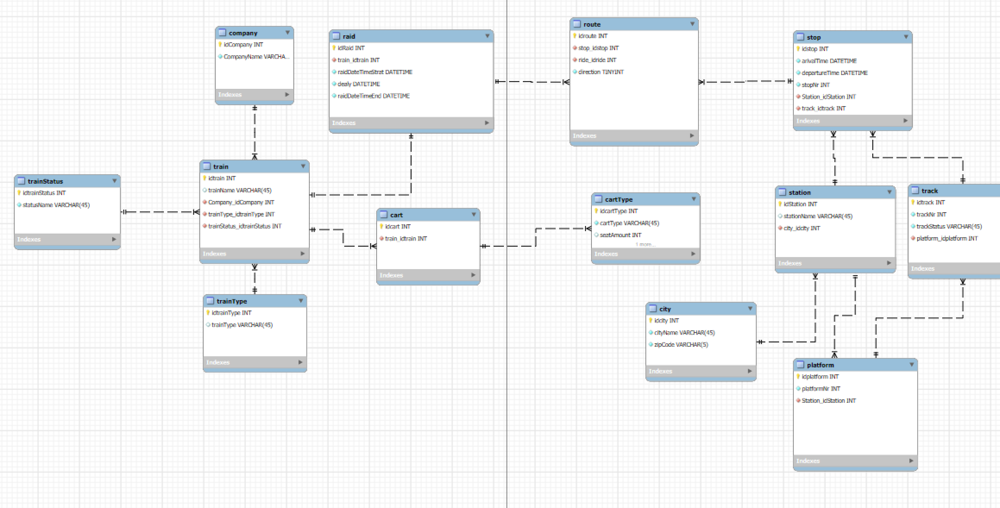
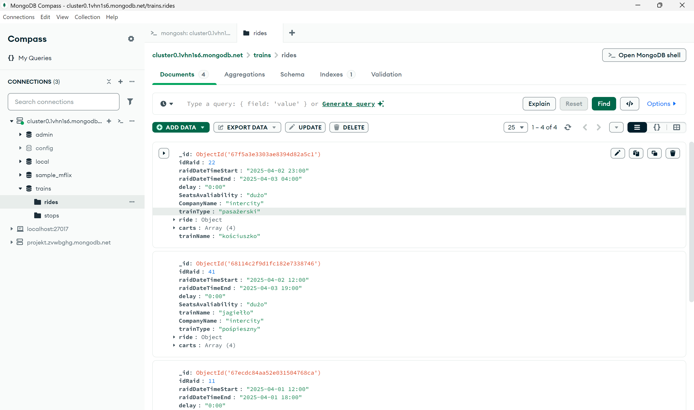
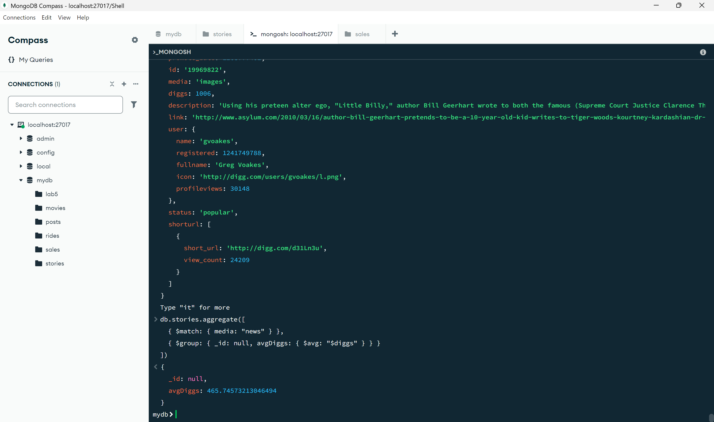

# MySQL
## Autor: Jan Drewienkowski
### mydb.sql/Skrypt-projekt
Pliki te przedstawiają skrypt, jaki został zimportowany z MySQL Workbench.
### iliketrains.mwb
Plik ten przedstawia model bazy danych związanej z przejazdami pociągów, które zostały przedstawione w diagramie EER.

# NoSQL
### trains.rides.json/trains.stops.json
Pliki te przedstawiają dwie kolekcje, które przedstawiane są w programie MongoDB Compass

